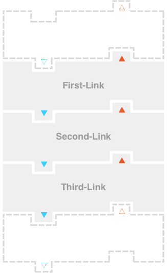
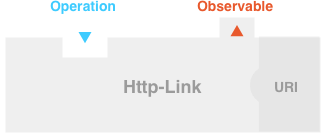
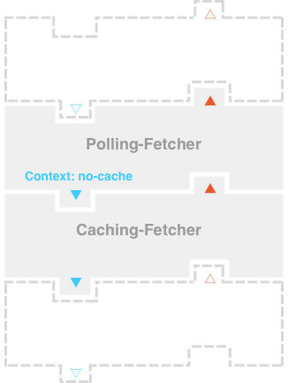
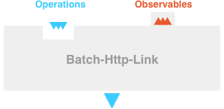
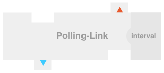
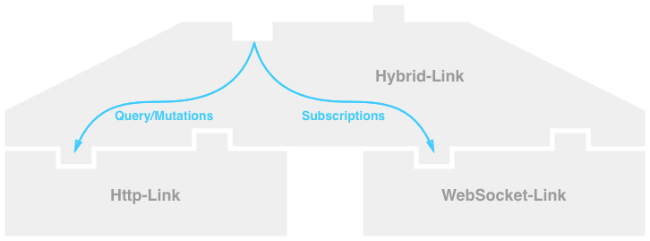
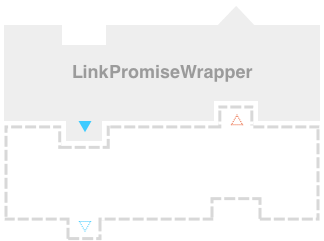

## Apollo Links

The purpose of Apollo Link is to define an extensible standard interface for modifying control flow of GraphQL queries and fetching GraphQL results.
To that end, Apollo Link describes an interface containing a single method, `request`, that connects a GraphQL `Operation` to an `Observable` containing the results of the operation.
Operations that return a single result can easily be mapped to a promise, since the observable's `next` function is called only once.
In the general case, Apollo Link uses observables to support GraphQL subscriptions and live queries.
The apollo-link's `Observable` follows the ECMAScript [proposal](https://github.com/tc39/proposal-observable).
A basic link is visualized as follows:

<p align="center">
  <br>
  
</p>

### Modular Architecture

To support a range of use cases with simple links, Apollo Links are designed as a modular system that composes links, chaining together their functionality.
Links communicate down their chain using a `forward` callback that passes an operation to the next link's `request` and returns the resulting observable.

This example chain contains an Intermediate Link that modifies the operation and passes it to `forward`.
`forward` then calls the Base Link's `request` on the operation, which returns an Observable.
This Observable is returned from `forward` and the Intermediate Link can subscribe and respond to the result.

This interaction is visualized below:

<p align="center">
  <br>
  
</p>


### Use cases

Apollo Links are designed to be used as an isomorphic stand-alone extensible GraphQL client.
In addition, links fit all current and anticipated needs of Apollo Client.
As such, links are targeted towards the following use-cases:

* Do a simple GraphQL query with it that resolves only once
* Do a simple GraphQL mutation that resolves only once
* Do a subscription
* Do a GraphQL query that contains @defer, @stream or @live
  * Support custom annotations, such as @connection

<br>

* Modify headers as middleware currently does
  * Add authentication headers
* Modify query, variables, operationName and context
  * Use persistent queries
* Support afterware to modify response or add side effects
  * Log queries
  * Perform analytics
  * Logout on 401
* Include extra metadata to server along with queries
  * Include component sending query
  * Send time stamp of query leaving transport
* Receive extra metadata with the query result
  * Send caching information

<br>

* Use HTTP transport, websocket transport, hybrid transport
* Use alternative transports
  * File System
  * DDP
* Mock partial or full response
* Route operations to alternate endpoints
  * Partial operations to REST endpoint
  * Partial operations to GraphQL endpoint
  * Partial operations to Mock
* Split single operation into multiple operations
  * Race one operation to local storage and another to network
* Per request retries based on network status or response
* Polling
* Batching at the transport/fetch layer
* Deduplicate of on-the-wire requests

<br>

* Network layer caching
  * Denormalized
  * Normalized
  * Local Storage
  * IndexDB

If you think of more use-cases, please open a PR adding to this list and make sure to clearly explain your use-case.

## Examples

### Stand Alone Client

http-link sends an operation over HTTP to a server at a constructor specified URI.
Additionally, the constructor accepts an optional fetch function and defaults to `ApolloFetch` from [apollo-fetch](https://github.com/apollographql/apollo-fetch).
HTTP specific behavior, such as middleware or afterware, is encapsulated in this fetch function.
In this manner, http-link can function as a stand-alone GraphQL client:

<p align="center">
  <br>
  
</p>

```js
const httpLink = new HttpLink({ uri: 'http://api.githunt.com/graphql' });

const responseObservable = httpLink.request({
  query,
  variables,
  operationName,
  context,
});

responseObservable.subscribe({
  next: data => console.log('received data', data),
  error: error => console.error(error),
  complete: () => console.log('request complete'),
});
```

### Composing Links in a Chain

To illustrate composing links, this example shows a polling link that sends an operation to an http link on a specified interval.

<p align="center">
  <br>
  
</p>

`Link` is a library of static helper functions that connects links together to form a `chain`.

```js
import { Link } from 'apollo-link';

Link.chain([
  new PollingLink({
    interval: 10000, //Polling Interval in ms
  }),
  new HttpLink({ uri: 'http://api.githunt.com/graphql' }),
])
```

Every link has access to the next link in the chain with a callback passed to `request`.
In this example, each operation is routed through the polling link to the http link and returned as an observable to the polling link.
The operation enters the polling link's `request` method, which would utilize the `forward` callback to pass the operation to the http link.
This snippet shows the general flow of the polling request, omitting the details around how `subscriber` notifies `pollingObservable` and error/completion handling.

```js
//Inside PollingLink class
request(operation, forward) {
  //forward makes a request call on the next link in the chain
  const httpResult = forward(operation);

  //subscriber would notify pollingObservable of the result
  httpResult.subscribe(this.subscriber);

  //next can be called multiple times, so make the request on the interval
  setTimeout(() => this.request(operation, forward), this.interval);

  //subscriber passes results to the pollingObservable
  return this.pollingObservable;
}
```

Additionally, `Link.chain` adds a compatibility layer that accepts a string as well as a GraphQL AST.
Before passing the `Operation` to the first link, `Link.chain` parses the query string, ensuring links only need to work with an AST.
With this interface, a chain can be the network stack for most GraphQL clients, including GraphiQL and Apollo Client.

The behavior of `Link.chain` can also be modified to include operations that occurring in between each link, such as logging.

### Communicating within a Chain

In addition to the query, operationName, and variables, `Operation` includes a context, which is modified and passed down the chain of links.
In addition, this context is sent to the server to through the query body.
In this example, `context` is used by a polling link to tell a caching link whether a request should be returned from the cache or the network.

<p align="center">
  <br>
  
</p>

## API

The link interface contains a single method:

```js
ApolloLink {
  request: (operation: Operation, forward?: NextLink) => Observable<FetchResult>
}

NextLink = (operation: Operation) => Observable<FetchResult>
```

An `Operation` contains all the information necessary to execute a GraphQL query, including the GraphQL AST:

```js
Operation {
  query?: DocumentNode,
  operationName?: string,
  variables?: object,
  context?: object,
}
```

An `Observable` is returned from `request` and notifies a `Subscriber` on the life-cycle of a GraphQL request:

```js
Observable {
  //Causes the underlying producer to start
  subscribe: (Subscriber<FetchResult>) => UnsubscribeHandler
  subscribe: (
    next: (FetchResult) => void,
    error: (any) => void,
    complete: () => void,
  ) => Subscription
```

A `Subscriber` is passed to `subscribe`

```js
Subscriber<T> {
  next?: (T) => void,
  error?: (any) => void,
  complete?: () => void,
}
```

`Subscription` is returned from `subscribe`.
`closed` returns if this `Subscription` is terminated by an `unsubscribe`, `complete`, or `error`

```js
Subscription {
    unsubscribe: () => void;
    get closed: () => boolean;
}
```

`FetchResult` is passed to the `next` callback of `Subscriber`

```js
FetchResult {
  data?: object,
  errors?: object[],
  extensions?: any,
  context?:object,
}
```

## More examples

Here is a list of planned links with selected diagrams:

Base:

* Websocket: subscriptions support
* Batching-\*: support for batching operations with a transport

<p align="center">
  <br>
  
</p>

Intermediate:

* Polling: repeats requests on a specified interval

<p align="center">
  <br>
  
</p>

* Caching: returns data if result in the cache and stores data in cache on response
* Compose: combines a list of links (would require additional semantics around constructor argument order)
* Dedup: saves query signatures that are currently on the wire and returns the result for all of those queries
* Retry: error callback causes the request to retry
* Mock: returns fake data for all or part of a request ← implement with BaseLink (eg. executes `graphql`)

Fork:

* Split: split operations between links depending on a function passed in
* Hybrid: uses split-link to fill query and mutations with http and subscriptions with websockets

<p align="center">
  <br>
  
</p>

The planned design for split adding another static function to `Link` with the following signature.
<!-- inspired by [recompose](https://github.com/acdlite/recompose/blob/master/docs/API.md#branch) -->

```js
  Link.split(
    test: (Operation) => boolean,
    left: ApolloLink[],
    right: ApolloLink[],
  ),
```

Suggestions are welcome, including other strategies or naming schemes.

An example usage would be:

```js
Link.chain([
  new RetryLink(),
  Link.split(
    isQueryOrMutation,
    [ new HttpLink() ],
    [ new WebSocketLink() ],
  ),
])
```

Adapter (not a Link):

* Promise Wrapper

<p align="center">
  <br>
  
</p>

* Backwards-compatibility Wrapper: exposes `query`, `mutate`, and `subscribe`

## Open questions, discussion

Throughout the design process, a couple questions have surfaced that may prompt conversation.
If you want to see something here, please open a PR with your proposed change or an Issue for discussion.

### How should we pass context to `next` callback along with the query data?

Should we pass the context from the response (for example relevant HTTP headers or status code) to the `next` callback of the observable like this:

```js
next({
  data,
  errors,
  extensions,
  context
})
```

or like this:

```js
next({
  result: {
    data,
    errors,
    extensions
  },
  context
})
```

### Should we include `status()` the Link interface that could contain user defined data and an enum for state?

```js
enum State {
  cold
  started
  stopped
  errored
  completed
}
```

If `status` exists and an `Observable` has terminated, should `subscribe` throw an error or call complete immediately, avoiding memory leaks.

<!--
### Does the subscribe method need to be overloaded? -> Yes, to make the Observable compatible

Currently the `subscribe` method has two different signatures, one that takes three functions `next`, `error`, and `complete` and another that takes a `Subscriber`.
Positional arguments are more prone to errors than passing object containing arguments.
The three function signature is present for compatibility with GraphiQL.

The suggested behavior of dealing with the overload is found in `AbstractObservable`.
-->

### Which convenience functions would you like?

The current functions provided:

* Link
  * chain
  * asPromiseWrapper
* LinkUtils
  * toSubscriber

Proposed additions include:

* Pull information from the Operation as part of `Operation` or `LinkUtil` library
  * hasQuery
  * hasMutation
  * hasSubscription
  * getQuery
  * getMutation
  * getSubscription
  * annotation support?
* Observable additions as required or optional part of interface and implemented in `AbstractObservable`
  * `map`
  * `filter`
  * `catch`
  * `finally`

### Should GraphQL errors be propagated up the stack with `next` or `error`?

Currently GraphQL errors are returned as data to `next`.
In the case of a network error, `error` is called.

<!--
### Should Link be functions or classes with wrapped constructors? -> class due to extensions and containing state

Links will be a class to provide the opportunity for extension and better describe that links can contain state.

```js
const httpLink = HttpLink({ uri: 'localhost' });
//or
const httpLink = new HttpLink({ uri: 'localhost' });
const httpLink = createHttpLink({ uri: 'localhost' });
```
-->

### Should Link include some form of synchronous adapter/behavior? What use cases warrant this?

Currently, everything in `apollo-link` is asynchronous.
There have been some abstract thoughts around providing some sort of synchronous adapter or cache.
Use cases and other thoughts are welcome!
