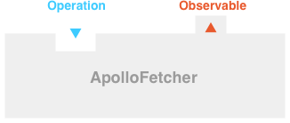
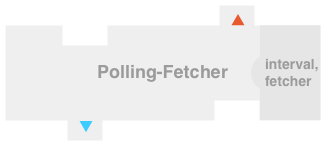
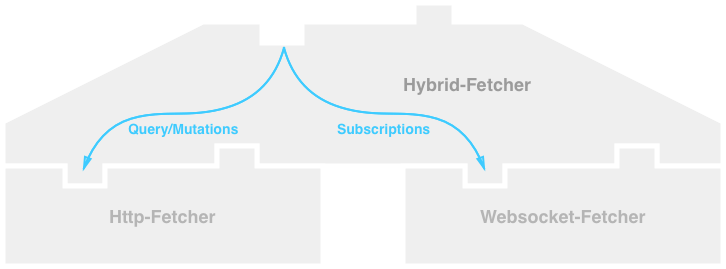
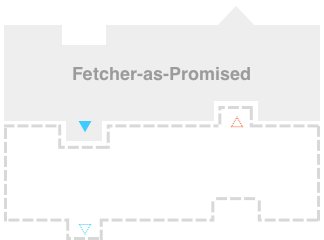

## Apollo Fetchers

The purpose of apollo-fetcher is to define an extensible standard interface for fetching GraphQL results. To that end, apollo-fetcher describes an interface containing a single method that connects a GraphQL `Operation` (also called request), to an `Observable` which delivers the results of the operation. Operations that return a single result can easily be mapped to a promise, since the observable's `next` function is called only once. In the general case, Apollo Fetcher uses observables to support GraphQL subscriptions and live queries. The apollo-fetcher's `Observable` follows the ECMAScript [proposal](https://github.com/tc39/proposal-observable), adding a `status` function. A basic fetcher is visualized as follows:

<p align="center">
  <br>
  
</p>

Fetchers are designed for current Apollo Client use-cases and to provide room for extensions. In addition to supporting Apollo Client, Apollo Fetchers are designed to be used independently as a very simple GraphQL client. These are the use cases that fetchers should support:

* Do a simple GraphQL query with it that resolves only once
* Do a simple GraphQL mutation that resolves only once
* Do a subscription
* Do a GraphQL query that contains @defer, @stream or @live
* Send extra metadata along with queries
* Support middleware to modify headers
* Support middleware to modify query, variables, operationName and metadata
* Isomorphic: It works in the browser and on the server
* Support afterware to modify response
* Support HTTP  transport, websocket transport, hybrid transport
* Support alternative transports
* Support per request retries based on network status or response
* Support HTTP transport batching
* Support polling
* Support batching
* Request deduplication of on-the-wire requests
* Support splitting: eg. send queries and mutations to different servers

Since this list focuses on Apollo Client's needs, please open a Pull Request adding to this list as you think of your desired use cases.

In order to support all these use cases with a simple fetcher design, we want to use a modular architecture that allows fetchers to delegate to other fetchers.

## Example

This repository will contain a family of canonical fetchers that provide example extensions. The goal of these canonical fetchers is to be self-contained without changing the context of each operation.

The current sample is http-fetcher, which sends an operation over http to a server at a specific URI. The uri and fetch function are passed to the constructor. This Http-fetcher can be used as a stand-alone GraphQL client:

<p align="center">
  <br>
  
</p>

```js
const httpFetcher = new HTTPFetcher({ uri: 'http://api.githunt.com/graphql' });

const responseObservable = httpFetcher.request({
  query,
  variables,
  operationName,
  context,
});

responseObservable.subscribe({
  next(data){ console.log('received data', data); },
  error(error){ console.error(error); },
  complete(){ console.error('request complete'); },
});
```

A fetcher can delegate to other fetchers. For example a polling fetcher can send a query operation to an http fetcher on a specified interval. Each request is routed through that http fetcher and returned through the observable returned by the polling fetcher. Using this type of delegation, fetchers can form stacks that each add their own functionality.

<p align="center">
  <br>
  
</p>


```js
const pollingFetcher = new PollingFetcher(
  10000, //Polling Interval in ms
  new HTTPFetcher({ uri: 'http://api.githunt.com/graphql' })
);
```

In addition to the query, `Operation` includes a context, which is modified and passed down the stack of fetchers. In addition, this context is sent to the server to through the query body. This context could be used by a polling fetcher to tell a caching fetcher a request should be returned from the cache or not.

<p align="center">
  <br>
  
</p>

## API

The fetcher interface contains a single method:

```js
interface ApolloFetcher{
  request(Operation) : Observable<FetchResult>
}
```

An Operation contains the AST for a particular query, variables and associated context:

```js
Operation {
  query: DocumentNode,
  operationName: string,
  variables: object,
  context: object,
}
```

An `Observable` is returned from the `request` function and controls the life-cycle of a GraphQL request:

```js
Observable{
  //Causes the underlying producer to start
  subscribe(Subscriber<FetchResult>) : UnsubscribeHandler
  subscribe(
    next(FetcheResult) => void,
    error(any) => void,
    complete() => void) : UnsubscribeHandler
  status(): any
}
```

A Subscriber is passed to the `subscribe` function

```js
Subscriber<T>{
  next(T),
  error(any),
  complete(),
}
```

UnsubscribeHandler is returned from a `subscribe` function in the Observable

```js
type UnscubscribeHandler = () => void
```

FetchResult is passed to the `next` function in the Observable

```js
FetchResult{
  data?: object,
  errors?: object[],
  extensions?: any,
  context?:object,
}
```

* Should explain what might go into context.

## More examples

Here is a list of planned fetchers with selected diagrams:

Base

* Websocket: subscriptions support
* Batching-\*: support for batching operations with a transport

<p align="center">
  <br>
  
</p>

Intermediate

* Polling: repeats requests on a specified interval

<p align="center">
  <br>
  
</p>

* Caching: returns data if result in the cache and stores data in cache on response
* Compose: combines a list of fetchers (would require additional semantics around constructor argument order)
* Dedup: saves query signatures that are currently on the wire and returns the result for all of those queries
* NPlusOne: adds query based on predicted access
* Retry: error callback causes the request to retry
* Mock: returns fake data for all or part of a request ← implement with BaseFetcher (eg. executes `graphql`)

Forks:

* Split: split operations between fetchers depending on a function passed in
* Hybrid: uses split-fetcher to fill query and mutations with http and subscriptions with websockets

<p align="center">
  <br>
  
</p>

Adapters:

* Wrapper => returns a promise : not a fetcher

<p align="center">
  <br>
  
</p>

## Open questions, discussion

> Pass context to the `next` callback along with the query data?


Status is complete when finished and if anyone subscribes call complete to avoid memory leaks (other option is error)

subscribe method need to have the Subscriber prototype.
Which convenience functions would you like:

* toSubscriber
* AST function: get operation
*

Status would contain user defined data and an enum for state:

```js
enum State{
  cold
  started
  stopped
  errored
  completed
}
```


